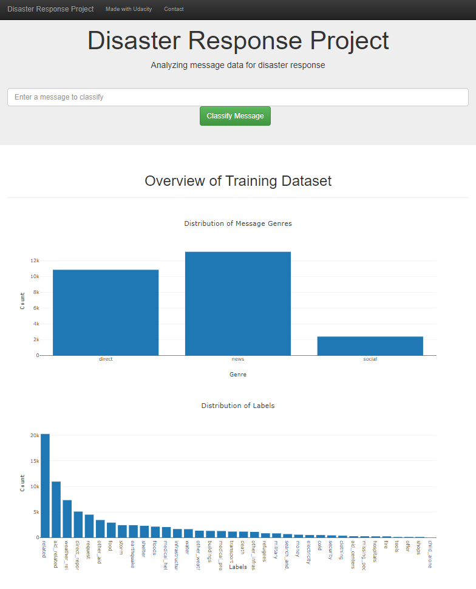
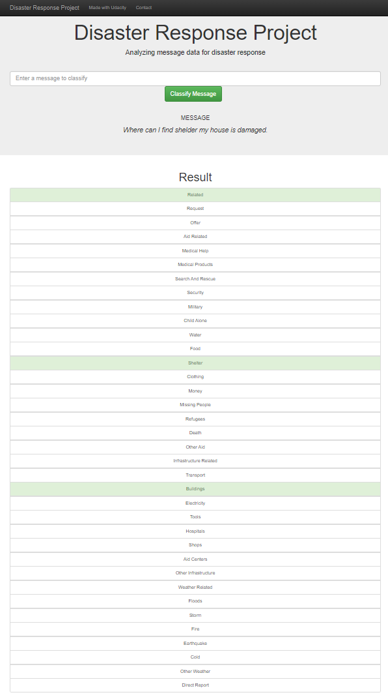

# Disaster Response Pipeline Project

### Introduction:
In this project it was required to apply data engineering skills to build a model for an API that classifies disaster messages from [Appen]( https://appen.com/#customers) (formally Figure 8). The provided dataset contains real messages which were sent during disaster events. To categorize this disaster events a machine learning pipeline was built. In combination with a web app it become possible that disaster messages can be inputted by emergency workers. They received classification can be used to send further the messages to an appropriated disaster relief agency. 
The web app to classify disaster messages.
### Table of Contents

1. [Instructions](#instructions)
2. [Project Overview](#overview)
3. [File Descriptions](#files)
4. [Results](#results)
5. [License](#license) 

## Instructions: <a name="instructions"></a>
1. Run the following commands in the project's root directory to set up your database and model.
    - Activate disaster_response _environment environment
        `source disaster_response_environment/bin/activate`
    - To run ` ETL pipeline ` that cleans data and stores in database
        `python data/process_data.py data/disaster_messages.csv data/disaster_categories.csv data/DisasterResponse.db`
    - To run ` ML pipeline ` that trains classifier and saves
        `python models/train_classifier.py data/DisasterResponse.db models/classifier.pkl`

2. Run the following command in the app's directory root to setup your web app.
    `python run.py`

3. Go to http://0.0.0.0:3000/

## Project Overview: <a name="overview"></a>
1.	**ETL Pipeline**
    - The script takes the file paths of the two datasets ` disaster_categories.csv` ` disaster_messages.csv`and database, cleans the datasets, and stores the clean data into a SQLite database in the specified database file path. Therefore, it merges the messages and categories datasets, splits the categories column into separate, clearly named columns, converts values to binary, and drops duplicates. 
2.	**ML Pipeline**
    - The script takes the database file path of  `DisasterResponse.db` and model file path, creates and trains a classifier, and stores the classifier into a **pickle file** to the specified model file path. 
     - The script uses a custom tokenize function using **nltk** to case normalize, lemmatize, and tokenize text. This function is used in the machine learning pipeline to vectorize and then apply **TF-IDF** to the text.
    - The script builds a pipeline that processes text and then performs **multi-output classification on the 36 categories** in the dataset. **GridSearchCV** is used to find the best parameters for the model.
    - The **TF-IDF pipeline** is only trained with the training data. The **f1 score**, precision and recall for the test set is outputted for each category.
3.	**Flask Web APP**
    - The main page includes at two visualizations using `Plotly´ and data from the **SQLite** database.

## File Descriptions: <a name="files"></a>
The project contains the following files:

```
DisasterResponsePipline/
│
├── app/
│   ├── template/
│       ├── __init__.py # not needed in final implementation
│       ├──run.py  # Flask file that runs app
│
├── data/
│   ├── DisaserResponse.db   # not needed
│   ├── DisasterResponse.db   # database to save clean data for ML pip
│   ├── YourDatabseName.db   # not needed
│   ├── disaster_categories.csv  
│   ├── disaster_messages.csv  
│   ├── process_data.py
│   ├── DisasterResponse.db   # database to save clean data for ML pip
│
├── models/
│   ├── __init__.py # not needed in final implementation
│   ├── classifier.pkl  # saved model
│   ├── train_classifier.py
│
├── FlaskWebUI.png
├── FlaskWebUI_Input.png
├── LICENSE
├── README.md
├── __init__.py

```
## Results: <a name="results"></a>


Image 1 : Shows the Web App UI with the distribution of messages categories.



Image 2 : Shows the Web App UI were messages can be categoriest.

## License: <a name="license"></a>
Cretits to [UDACITY]( https://www.udacity.com/courses/all?gclid=EAIaIQobChMI2s_OnMDp_wIVguZ3Ch2emQwwEAAYASAAEgIWzfD_BwE&utm_campaign=18417257960_c_individuals&utm_keyword=udacity_e&utm_medium=ads_r&utm_source=gsem_brand&utm_term=140358351326) 

MIT License

Copyright (c) 2023 Zehentner David

Permission is hereby granted, free of charge, to any person obtaining a copy
of this software and associated documentation files (the "Software"), to deal
in the Software without restriction, including without limitation the rights
to use, copy, modify, merge, publish, distribute, sublicense, and/or sell
copies of the Software, and to permit persons to whom the Software is
furnished to do so, subject to the following conditions:

The above copyright notice and this permission notice shall be included in all
copies or substantial portions of the Software.

THE SOFTWARE IS PROVIDED "AS IS", WITHOUT WARRANTY OF ANY KIND, EXPRESS OR
IMPLIED, INCLUDING BUT NOT LIMITED TO THE WARRANTIES OF MERCHANTABILITY,
FITNESS FOR A PARTICULAR PURPOSE AND NONINFRINGEMENT. IN NO EVENT SHALL THE
AUTHORS OR COPYRIGHT HOLDERS BE LIABLE FOR ANY CLAIM, DAMAGES OR OTHER
LIABILITY, WHETHER IN AN ACTION OF CONTRACT, TORT OR OTHERWISE, ARISING FROM,
OUT OF OR IN CONNECTION WITH THE SOFTWARE OR THE USE OR OTHER DEALINGS IN THE
SOFTWARE.
